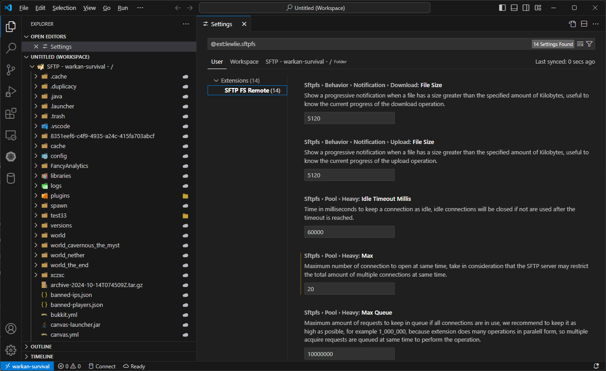
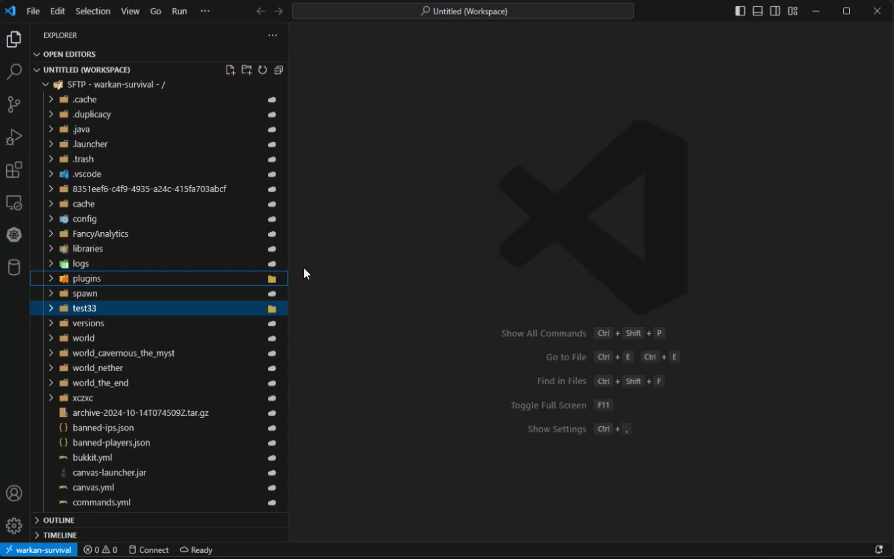
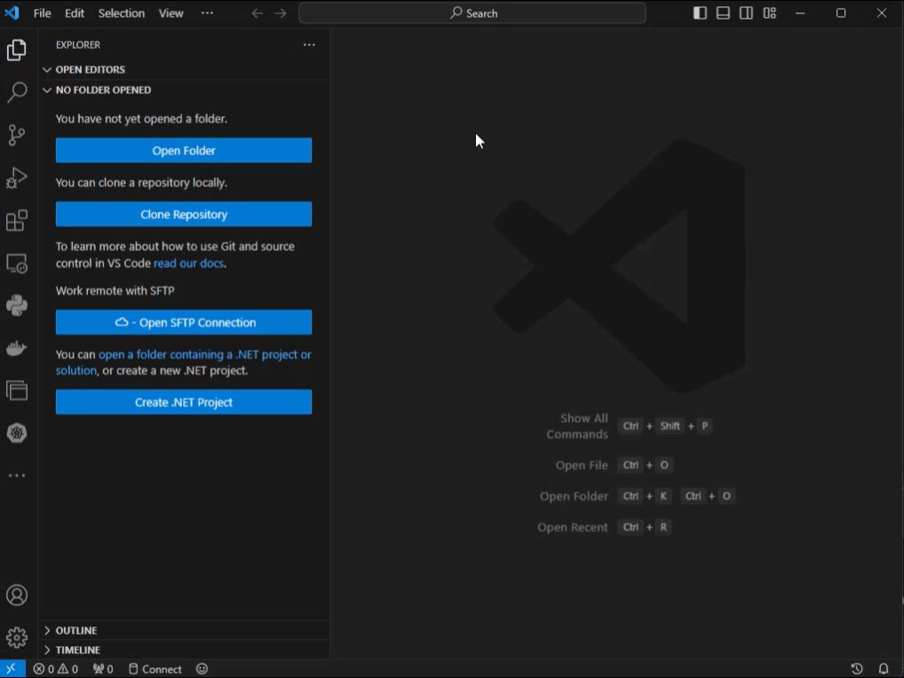

# SFTP File System

A fast and optimized SFTP file system extension, enabling you to work with SFTP files more efficiently than ever before!

## Features

### ✨ Optimized SFTP file system with parallel SFTP operations.

Tired of working with SFTP files and having to manually sync your local and remote files? 😫 With this extension, that’s a thing of the past! 🚀 Download and upload SFTP files in seconds. ⏱️📂


This is possible thanks to excellent handling of simultaneous SFTP connections, which boosts speed and efficiency when working with multiple SFTP files at same time. ⚡📁🚀


### ⚙️ Highly configurable.

Highly configurable extension that adapts to the needs of your environment. ⚙️🌐✨



### ⚡ Easily manipulate SFTP files locally and remotely.

Efficiently sync your files! 🔄 SFTP FS does all the work for you, checking the current state of your local and remote files and performing the necessary upload/download operations. 📥📤🚀



### 🚀 Work with multiple SFTP workspaces at the same time.

Work with multiple SFTP folders at the same time! 📂✨ All in one place.



## 📋 Requirements

* SFTP server to connect to. 🌐
* VS Code 1.95.0 or higher; if you need support for an earlier version, please open a request through GitHub. 📥🐙

## ⚙️ Extension Settings

This extension contributes the following settings:

### 🛠️ Behavior
* `sftpfs.behavior.notification.upload.fileSize`: (Upload): Display a progress notification when a file exceeds the specified size in kilobytes, making it easy to track the current upload progress.
* `sftpfs.behavior.notification.download.fileSize`: (Download): Display a progress notification when a file exceeds the specified size in kilobytes, making it easy to track the current upload progress.

### 📦 Cache
* `sftpfs.cache.metadata.files.seconds`: How long, in seconds, should file metadata be kept in the cache to improve certain operations, such as directory listing and uploading/downloading multiple files.

### 🦊 Pool configuration

> The app uses two types of pools: a **passive** pool and a **heavy** pool.
> 
> The **passive** pool is intended for low-cost operations like listing directories, opening files, renaming folders/files, etc. Lower values are recommended for this pool.
> 
> The **heavy** pool, in contrast, is used for high-cost operations such as downloading or uploading large quantities of files. Set higher values for this pool, depending on the limitations of your SFTP server, as some servers restrict the number of simultaneous connections a user can open.

The following configurations apply to both types of pools. Replace `<type>` with the appropriate pool type: `passive` or `heavy`.

* `sftpfs.pool.<type>.max`: The maximum number of connections to open simultaneously. Keep in mind that the SFTP server may limit the total number of concurrent connections.
* `sftpfs.pool.<type>.min`: The minimum number of connections to keep in the pool for future requests. For optimal performance, it's recommended to set this to at least 1/3 of the maximum connections. For example, if the maximum connections are set to 15, set this value to 5.
* `sftpfs.pool.<type>.minIdle`: The number of connections to keep idle. A connection is marked as idle after being released following an SFTP operation, allowing it to be reused for subsequent operations without the need to reopen the connection.
* `sftpfs.pool.<type>.maxQueue`: The maximum number of requests to keep in the queue when all connections are in use. We recommend setting this value as high as possible, for example, 1,000,000, as the extension performs many operations in parallel. This means multiple acquire requests are queued simultaneously to execute the operations.
* `sftpfs.pool.<type>.idleTimeoutMillis`: The time, in milliseconds, to keep a connection idle. Idle connections will be closed if they are not used after the specified timeout is reached.

### 🛜 Remote configuration

There are two ways to add a remote configuration to the extension:

1. Use the command "SFTP FS: Add remote..." (CTRL + SHIFT + P on Windows)
2. Edit the configuration directly.

For option #2, open your `settings.json` file and add the following configuration:

```
"sftpfs.remotes": {
  "YourNameForThisRemote": {
    "host": "YourSFTPHost",
    "port": 22,
    "username": "YourSFTPUsername",
    "password": "YourSFTPPassword",
    "remotePath": "/"
  },
  ...
  ...
  ... // Add as many as you need
},
```

### 🧩 Working Directories

The `sftpfs.workDirs` configuration is automatically updated by the extension when you select a folder to synchronize remote files with your local storage.

However, you can adjust the configuration through the settings.json file by modifying the following configuration block:

```
"sftpfs.workDirs": {
  "RemoteName": {
    "workDir": "/C:/MyPath/For/Local/Folder"
  }
},
```

## ⛓️‍💥 Known Issues

* Editing files locally (e.g., via the operating system's file explorer) will not be immediately reflected in the VS Code file explorer. I am currently working on an update to implement this feature.
* 🗂️ Download or upload of a large number of files using the Visual Studio Code file explorer is not done in parallel but one by one, making the operation slow. This is a limitation of Visual Studio Code, and there is currently no solution.
Instead of using the Visual Studio Code file explorer to upload files, place the files in your local folder, right-click folder in the file explorer of VSCode, and select the action "SFTP Dir Sync: 2. Local → Remote (upload)." to upload multiple files in parallel.

## 📋 Release Notes

### 🔹 1.1.1

* Improvement: Added validation to SFTP connections to check if connection is still valid before any SFTP operation, if connection is not valid a new connection is created and the previous connection is removed from the pool of connections.

### 🔹 1.1.0

* Fixed: When uploading files to the remote server, folder was always uploaded with a lowercase name regardless if folder name contained uppercase and lowercase letters. This has been fixed, and uploads are now handled correctly.
* Feature: A file metadata cache was added to improve upload and download times for multiple files without needing to query the remote server for already know metadata. Setting `sftpfs.cache.metadata.files.seconds` has been added to control this behavior.
* Feature: Implemented contextual menu actions "SFTP File Sync: 1. Remote → Local (download)" and "SFTP File Sync: 2. Local → Remote (upload)" to download/upload a single file from/to remote server.
* Improvement: The "Reveal in File Explorer" action has been improved; it now selects the file in system file explorer.
* Improvement: Files uploaded via VSCode file explorer now uses the setting `sftpfs.behavior.notification.upload.fileSize` to display a progressive notification when a file is uploaded.

### 🔹 1.0.1

A minor update to update marketplace page.

* Updated README.

### 🔹 1.0.0

Initial release of the extension with many features:

* View, create, edit, delete, move, and rename files/directories directly from the VS Code file explorer.
* Download entire directories from SFTP to local storage (right-click a folder and select "Sync Local -> Remote" from the context menu).
* Upload entire directories from local storage to SFTP (right-click a folder and select "Sync Remote -> Local" from the context menu).
* Sync folders between both directions, local <-> SFTP (right-click a folder and select "Sync Remote <-> Local" from the context menu).
* Added configurations to manage settings for SFTP connection pools used by the extension.
* Option in the context menu to disconnect from the SFTP server.
* Option in the context menu to remove local copies of remote files without deleting the remote files (right-click a folder and select "Remove local file").

----

_Made with love by the LewLie Team 🦊🐺_
